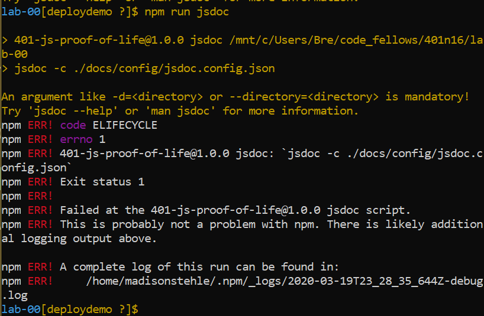

# LAB - Class 01, Code 401n16

## Notes

### Author: Madison Stehle

### Links and Resources

- [submission PR](https://github.com/madisonstehle/notes/pull/7)
- [ci/cd](https://github.com/madisonstehle/notes/actions) (GitHub Actions)
- [npm](https://www.npmjs.com/package/notes-lab01-madisonstehle)

### Documentation
JSDoc is not running. See error message below:

### Setup
#### How to initialize/run your application (where applicable)

- `npm start`
- `node index.js`
- `notes <flag> <other content>`
  - flags:
    - `-a "<note content>"`, `--add "<note content>"`: add a note
    - `-c <category name>`, `--category <category name>`: add a category (to be used in the same line as the `-a` flag)
    - `-l <OPTIONAL category filter>`, `--list <OPTIONAL category filter>`: list notes with or without a categorical filter
    - `-d <id>`, `--delete <id>`: delete a note by note ID

#### Tests

- Unit Test: `npm test`
- Lint Test: `npm run lint`

#### UML

Link to an image of the UML for your application and response to events

## Credits
- Thank you to Sonia for providing an in-depth walk through of most of this application
- Thank you to Earl Jay and Daniel for talking through how to run a console.log spy using jest for notes.test.js